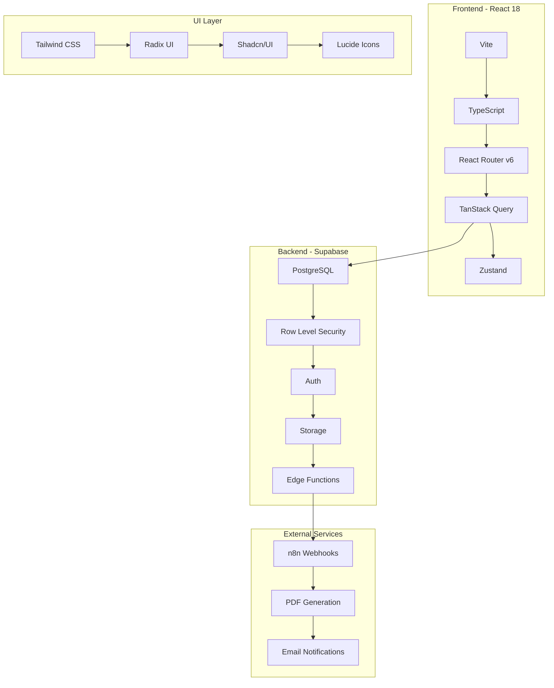
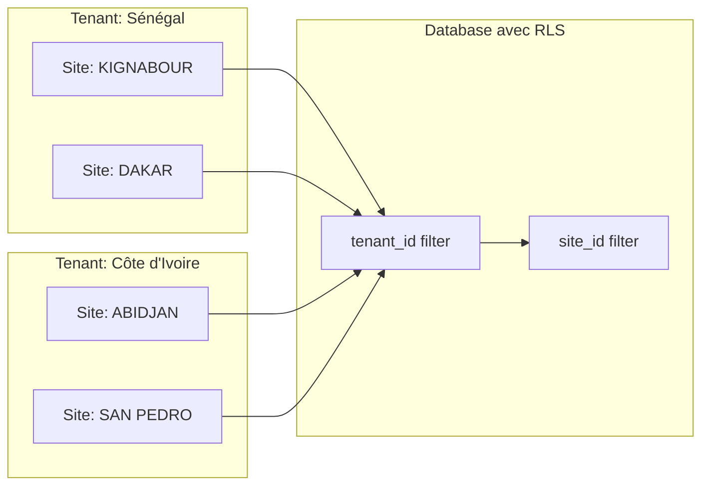
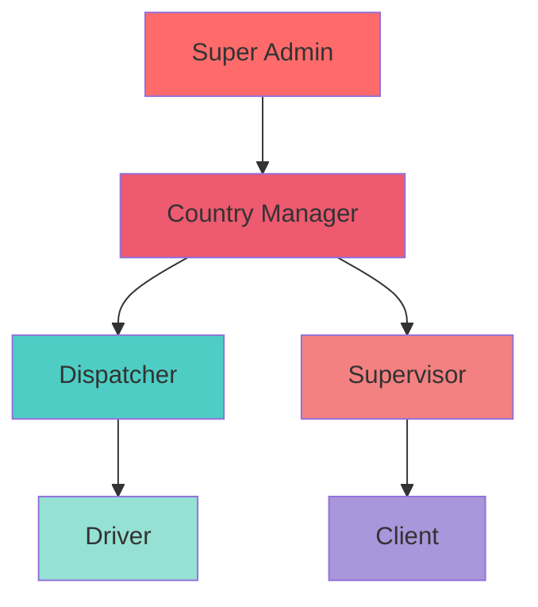
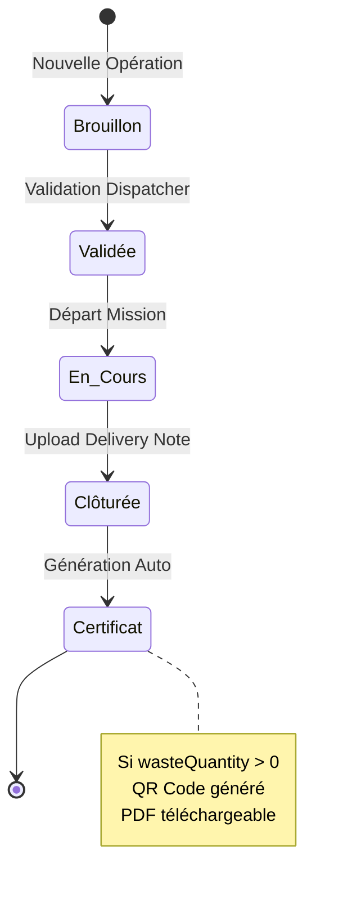
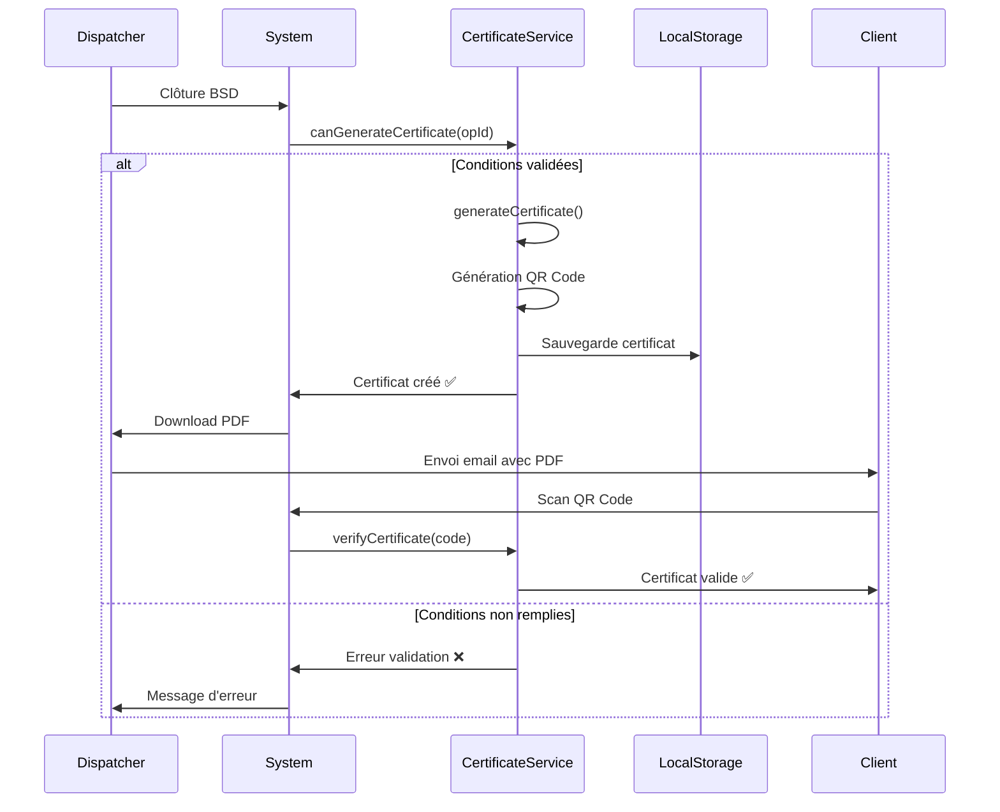
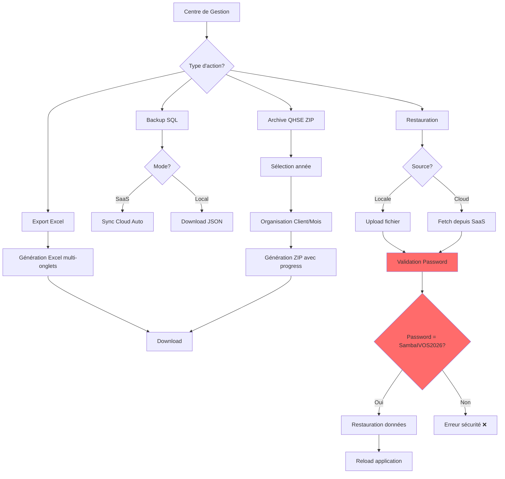

# 📘 Guide Développeur IVOS 61.1

## Table des Matières

1. [Architecture Globale](#architecture-globale)
2. [Workflows Principaux](#workflows-principaux)
3. [Structure des Données](#structure-des-données)
4. [Services Critiques](#services-critiques)
5. [Guide de Développement](#guide-de-développement)
6. [Tests](#tests)
7. [Déploiement](#déploiement)

---

## Architecture Globale

### Stack Technique



### Architecture Multi-Tenant



### RBAC - 6 Rôles



---

## Workflows Principaux

### Workflow BSD (Bordereau de Suivi des Déchets)



### Workflow Certificat QHSE



### Workflow Backup & Restauration



---

## Structure des Données

### Modèle Operation (BSD)

```typescript
interface Operation {
  id: string;
  code: string; // BSD-KIG-2026-0001
  status: 'brouillon' | 'validee' | 'en_cours' | 'cloturee';
  
  // Informations générales
  client: string;
  typeDechet: string;
  dateDepart: string;
  
  // Véhicule & Personnel
  vehicule: string;
  immatriculation: string;
  chauffeur: string;
  
  // BSD Data
  bsdData?: {
    section1?: boolean;
    section2?: boolean;
    // ... sections 3-9
    wasteQuantity?: number;
    wasteUnit?: string;
    validatedAt?: string;
  };
  
  // Delivery Note
  deliveryNote?: {
    uploadedAt: string;
    fileUrl: string;
  };
  
  // Métadonnées
  createdAt: string;
  createdBy: string;
  updatedAt: string;
}
```

### Modèle Certificate

```typescript
interface Certificate {
  id: string;
  certificateNumber: string; // CERT-KIG-2026-0001
  verificationCode: string; // 12 caractères A-Z0-9
  qrCodeData: string; // URL de vérification
  
  // Données métier
  operationId: string;
  operationCode: string;
  clientName: string;
  wasteType: string;
  wasteQuantity: number;
  wasteUnit: string;
  collectionDate: string;
  disposalSite: string;
  vehicleRegistration: string;
  
  // Tracking
  generatedAt: string;
  generatedBy: string;
  sentAt?: string;
  verifiedAt?: string;
}
```

### Modèle BackupAction

```typescript
interface BackupAction {
  id: string;
  date: string; // ISO 8601
  user: string;
  type: 'export_qhse' | 'backup_manual' | 'backup_auto' | 'restore_local' | 'restore_cloud';
  status: 'success' | 'error' | 'pending';
  details: string;
}
```

---

## Services Critiques

### certificateService.ts

**Responsabilités** :
- Génération certificats QHSE
- Validation opérations
- Vérification QR Code
- Tracking lifecycle

**Fonctions principales** :
```typescript
// Vérifier si certificat peut être généré
canGenerateCertificate(operationId: string): {
  canGenerate: boolean;
  reason?: string;
}

// Générer nouveau certificat
generateCertificate(params: CertificateGenerationParams): Certificate

// Vérifier un code QR
verifyCertificate(code: string): CertificateVerificationResult

// Marquer comme envoyé/vérifié
markCertificateAsSent(id: string): void
markCertificateAsVerified(id: string): void
```

**Storage** :
- Key: `ivos_certificates_v1`
- Type: `Certificate[]`
- Events: `ivos_certificates_change`

### backupService.ts

**Responsabilités** :
- Exports Excel/SQL/ZIP
- Sync Cloud
- Restauration sécurisée
- Audit trail

**Fonctions principales** :
```typescript
// Logging actions
logBackupAction(type, status, details, user): void
getRecentActions(limit = 10): BackupAction[]

// Cloud Sync
getLastCloudSync(): { date, status }
updateCloudSync(status): void

// SQL Backup
generateSQLBackup(site, year): Blob
downloadSQLBackup(site, year): void

// QHSE Archive
generateQHSEArchive(year, onProgress): Promise<Blob>
downloadQHSEArchive(year, onProgress): Promise<void>

// Restoration
restoreFromFile(file, password): Promise<boolean>
restoreFromCloud(password): Promise<boolean>
```

**Sécurité** :
- Password: `SambaIVOS2026` (hardcodé)
- Validation obligatoire
- Avertissement modal critique

---

## Guide de Développement

### Installation

```bash
# Clone repository
git clone <repo-url>
cd IVOS-61.1

# Install dependencies
npm install --legacy-peer-deps

# Configure environment
cp .env.example .env
# Remplir VITE_SUPABASE_URL et VITE_SUPABASE_ANON_KEY

# Start development server
npm run dev
```

### Commandes NPM

```bash
npm run dev              # Lancer Vite dev server
npm run build            # Build production
npm run preview          # Preview build
npm run type-check       # TypeScript validation
npm run lint             # ESLint check
npm run format           # Prettier format
npm run test             # Run Jest tests
npm run test:coverage    # Coverage report
```

### Structure d'un Nouveau Module

```
src/features/mon-module/
├── pages/
│   └── MonModulePage.tsx      # Page principale
├── components/
│   └── MonComposant.tsx       # Composants spécifiques
├── services/
│   └── monModuleService.ts    # Logique métier
└── types/
    └── monModule.types.ts     # Types TypeScript
```

### Créer un Nouveau Service

```typescript
// src/features/mon-module/services/monService.ts

/**
 * Service de gestion de [fonctionnalité]
 * 
 * @module monService
 */

const STORAGE_KEY = 'ivos_mon_module_v1';

/**
 * Récupérer toutes les entités
 * 
 * @returns {Entity[]} Liste des entités
 * @example
 * const entities = getAllEntities();
 */
export function getAllEntities(): Entity[] {
  try {
    const data = localStorage.getItem(STORAGE_KEY);
    return data ? JSON.parse(data) : [];
  } catch {
    return [];
  }
}

/**
 * Créer une nouvelle entité
 * 
 * @param {EntityInput} input - Données d'entrée
 * @returns {Entity} Entité créée
 * @throws {Error} Si validation échoue
 * @example
 * const entity = createEntity({
 *   name: 'Test',
 *   value: 42
 * });
 */
export function createEntity(input: EntityInput): Entity {
  // Validation
  if (!input.name) {
    throw new Error('Name is required');
  }
  
  // Création
  const entity: Entity = {
    id: `ENT-${Date.now()}`,
    ...input,
    createdAt: new Date().toISOString()
  };
  
  // Sauvegarde
  const entities = getAllEntities();
  entities.push(entity);
  localStorage.setItem(STORAGE_KEY, JSON.stringify(entities));
  
  // Notification
  window.dispatchEvent(new CustomEvent('ivos_entities_change'));
  
  return entity;
}
```

### Créer une Nouvelle Page

```typescript
// src/features/mon-module/pages/MonModulePage.tsx

import React, { useState, useEffect } from 'react';
import { Database, Plus } from 'lucide-react';
import { getAllEntities, createEntity } from '../services/monService';
import type { Entity } from '../types/monModule.types';

/**
 * Page principale du module [MonModule]
 * 
 * Fonctionnalités :
 * - Liste des entités
 * - Création nouvelle entité
 * - Édition/Suppression
 */
export default function MonModulePage() {
  const [entities, setEntities] = useState<Entity[]>([]);
  const [loading, setLoading] = useState(true);
  
  // Charger les données
  useEffect(() => {
    loadEntities();
    
    // Écouter les changements
    const handleChange = () => loadEntities();
    window.addEventListener('ivos_entities_change', handleChange);
    
    return () => {
      window.removeEventListener('ivos_entities_change', handleChange);
    };
  }, []);
  
  const loadEntities = () => {
    setEntities(getAllEntities());
    setLoading(false);
  };
  
  if (loading) {
    return <div className="p-8">Chargement...</div>;
  }
  
  return (
    <div className="w-full min-h-screen space-y-6">
      {/* Header */}
      <div className="bg-gradient-to-r from-[#1a1a2e] to-[#0f3460] rounded-2xl p-6 text-white">
        <div className="flex items-center gap-4">
          <Database className="w-8 h-8" />
          <div>
            <h1 className="text-3xl font-bold">Mon Module</h1>
            <p className="text-sm text-gray-300">Gestion des entités</p>
          </div>
        </div>
      </div>
      
      {/* Content */}
      <div className="grid grid-cols-1 gap-6">
        {entities.map(entity => (
          <div key={entity.id} className="bg-white rounded-xl p-4 border">
            <h3 className="font-bold">{entity.name}</h3>
            <p className="text-sm text-gray-600">{entity.createdAt}</p>
          </div>
        ))}
      </div>
    </div>
  );
}
```

### Ajouter une Route

```typescript
// src/app/App.tsx

import MonModulePage from '../features/mon-module/pages/MonModulePage';

// Dans le composant App, ajouter :
<Route path="mon-module" element={<MonModulePage />} />
```

### Ajouter au Menu

```typescript
// src/layouts/DashboardLayout.tsx

// Dans le tableau menuItems, ajouter :
{
  category: 'MON SECTEUR',
  items: [
    {
      name: 'Mon Module',
      href: '/mon-module',
      icon: Database,
      tooltip: 'Gestion des entités'
    }
  ]
}
```

---

## Tests

### Lancer les Tests

```bash
# Tous les tests
npm run test

# Mode watch
npm run test:watch

# Coverage
npm run test:coverage
```

### Exemple de Test Unitaire

```typescript
describe('monService', () => {
  beforeEach(() => {
    localStorage.clear();
  });
  
  it('devrait créer une entité', () => {
    const entity = createEntity({
      name: 'Test',
      value: 42
    });
    
    expect(entity.id).toBeDefined();
    expect(entity.name).toBe('Test');
    expect(entity.value).toBe(42);
  });
  
  it('devrait retourner toutes les entités', () => {
    createEntity({ name: 'E1', value: 1 });
    createEntity({ name: 'E2', value: 2 });
    
    const entities = getAllEntities();
    expect(entities).toHaveLength(2);
  });
});
```

### Tests Disponibles

- ✅ `backupService.test.ts` - Service de sauvegardes
- ✅ `certificateService.test.ts` - Service de certificats

---

## Déploiement

### Build Production

```bash
# Build
npm run build

# Preview
npm run preview
```

### Variables d'Environnement

```env
VITE_SUPABASE_URL=https://xxx.supabase.co
VITE_SUPABASE_ANON_KEY=eyJxxx...
VITE_APP_ENV=production
VITE_APP_VERSION=1.0.0
```

### Checklist Déploiement

- [ ] Tests passent : `npm run test`
- [ ] TypeScript valide : `npm run type-check`
- [ ] ESLint sans erreurs : `npm run lint`
- [ ] Build réussit : `npm run build`
- [ ] Variables d'env configurées
- [ ] Supabase migrations appliquées
- [ ] RLS policies activées
- [ ] Webhooks n8n configurés

---

## Bonnes Pratiques

### TypeScript

```typescript
// ✅ BON - Types explicites
function processOperation(op: Operation): Certificate | null {
  if (!canGenerateCertificate(op.id).canGenerate) {
    return null;
  }
  return generateCertificate({...});
}

// ❌ MAUVAIS - any partout
function processOperation(op: any): any {
  // ...
}
```

### React Hooks

```typescript
// ✅ BON - Cleanup dans useEffect
useEffect(() => {
  const handleChange = () => loadData();
  window.addEventListener('ivos_data_change', handleChange);
  
  return () => {
    window.removeEventListener('ivos_data_change', handleChange);
  };
}, []);

// ❌ MAUVAIS - Pas de cleanup
useEffect(() => {
  window.addEventListener('ivos_data_change', loadData);
}, []);
```

### LocalStorage

```typescript
// ✅ BON - Gestion d'erreurs
try {
  const data = localStorage.getItem('key');
  return data ? JSON.parse(data) : [];
} catch {
  return [];
}

// ❌ MAUVAIS - Crash si données corrompues
const data = JSON.parse(localStorage.getItem('key'));
```

---

## Support & Contact

- **Documentation** : Ce fichier
- **Issues** : GitHub Issues
- **Tests** : `npm run test`
- **TypeScript** : `npm run type-check`

---

**Dernière mise à jour** : 21 avril 2026  
**Version** : 1.0.0  
**Auteur** : Équipe IVOS
