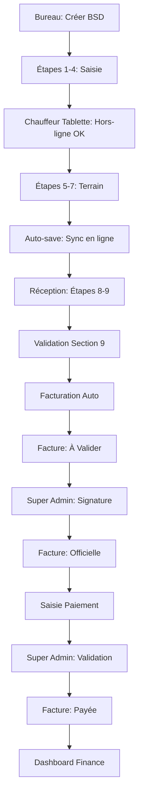

# Système Complet de Liaison Terrain-Comptabilité-Trésorerie

## 📋 Vue d'Ensemble

Ce système finalise le cœur de l'application IVOS en liant :
- **Le terrain** (chauffeurs sur tablettes)
- **La comptabilité** (facturation automatique)
- **La trésorerie** (gestion des paiements)

---

## 🏗️ Architecture du Système

### 1. Services Core

#### **autoSaveService.ts**
Gestion de l'auto-sauvegarde avec indicateur visuel temps réel.

**Fonctionnalités :**
- Auto-save avec debounce (1.5s par défaut)
- Indicateur visuel : `idle` | `saving` | `saved` | `error`
- Force save pour sauvegardes immédiates
- Hook React `useAutoSave` pour intégration facile

**Utilisation :**
```typescript
import { useAutoSave } from '@/shared/services/autoSaveService';

// Dans un composant
const saveState = useAutoSave(
  'bsd-form-123', // Clé unique
  formData,       // Données à sauvegarder
  async (data) => {
    // Fonction de sauvegarde (localStorage, API, etc.)
    localStorage.setItem('bsd', JSON.stringify(data));
  },
  { enabled: true, debounce: 1500 }
);

// Afficher l'indicateur
<AutoSaveIndicator {...saveState} />
```

---

#### **offlineService.ts**
Mode hors-ligne avec IndexedDB pour les chauffeurs sur terrain.

**Fonctionnalités :**
- Stockage IndexedDB des brouillons BSD
- File d'attente d'actions (create, update, delete)
- Synchronisation automatique au retour réseau
- Support online/offline detection

**Utilisation :**
```typescript
import { offlineService } from '@/shared/services/offlineService';

// Sauvegarder un brouillon BSD hors-ligne
await offlineService.saveBSDDraft('operation-123', bsdData);

// Récupérer un brouillon
const draft = await offlineService.getBSDDraft('operation-123');

// Ajouter une action en attente
await offlineService.addPendingAction('update', 'bsd', {
  operationId: 'op-123',
  bsdData: { ... }
});

// La synchronisation se fait automatiquement au retour en ligne
```

---

#### **paymentService.ts**
Gestion complète des paiements avec 4 modes de règlement.

**Modes de paiement :**
1. **Virement** : Référence bancaire + Banque émettrice
2. **Chèque** : Numéro chèque + Banque
3. **Espèces** : Nom du remettant
4. **Autre** : Détails libres

**Workflow de paiement :**
```
1. Création paiement (status: en_attente)
   ↓
2. Validation Super Admin (status: valide)
   ↓
3. Encaissement (status: encaisse)
   ↓
4. Facture → status: payee
   ↓
5. Apparition Dashboard Finance
```

**Utilisation :**
```typescript
import { createPayment, validatePayment } from '@/features/finances/services/paymentService';

// Créer un paiement
const payment = createPayment(
  'invoice-123',
  'FAC-2026-0001',
  'Client ABC',
  5000000, // Montant en FCFA
  'virement',
  {
    referenceBancaire: 'VIR-2026-12345',
    banqueEmettrice: 'CBAO'
  },
  'Jean Dupont',
  'Paiement partiel'
);

// Valider (Super Admin uniquement)
validatePayment(payment.id, 'Samba');
```

---

#### **workflowService.ts**
Workflow BSD en 9 étapes avec gestion des rôles.

**Étapes :**
| Étape | Label | Rôle | Type |
|-------|-------|------|------|
| 1 | Producteur | Bureau | Manuel |
| 2 | Collecteur | Bureau | Auto |
| 3 | Dénomination | Bureau | Manuel |
| 4 | Conditionnement | Bureau | Manuel |
| 5 | Signature Producteur | Chauffeur | Auto |
| 6 | Pesée | Chauffeur | Manuel |
| 7 | Signature Chauffeur | Chauffeur | Auto |
| 8 | Réception Site | Réception | Manuel |
| 9 | Traitement Final | Réception | Manuel |

**Utilisation :**
```typescript
import { 
  getCurrentStep, 
  getWorkflowProgress, 
  canUserEditStep 
} from '@/features/exploitation/services/workflowService';

// Étape actuelle
const currentStep = getCurrentStep(bsdData); // 1-9

// Progression (%)
const progress = getWorkflowProgress(bsdData); // 0-100

// Vérifier si un utilisateur peut éditer
const canEdit = canUserEditStep(3, userRole, bsdStatus);
```

---

### 2. Composants UI

#### **AutoSaveIndicator.tsx**
Indicateur visuel en haut à droite de l'écran.

**États :**
- 🟡 **Saving** : "Enregistrement en cours..."
- 🟢 **Saved** : "Modifications enregistrées (Il y a 5s)"
- 🔴 **Error** : "Erreur de sauvegarde"

**Props :**
```typescript
interface AutoSaveIndicatorProps {
  status: 'idle' | 'saving' | 'saved' | 'error';
  lastSaved?: string; // ISO date
  error?: string;
}
```

---

#### **PaymentForm.tsx**
Formulaire modal de saisie de paiement.

**Fonctionnalités :**
- 4 modes de paiement avec champs conditionnels
- Validation en temps réel
- Montant pré-rempli depuis la facture
- Notes optionnelles

**Props :**
```typescript
interface PaymentFormProps {
  invoice: WorkflowInvoice;
  onClose: () => void;
  onSuccess: () => void;
  currentUserName: string;
}
```

**Exemple d'utilisation :**
```tsx
const [showPaymentForm, setShowPaymentForm] = useState(false);

{showPaymentForm && (
  <PaymentForm
    invoice={selectedInvoice}
    onClose={() => setShowPaymentForm(false)}
    onSuccess={() => {
      setShowPaymentForm(false);
      loadInvoices();
    }}
    currentUserName={user?.name || ''}
  />
)}
```

---

#### **PaymentList.tsx**
Liste des paiements avec filtres et actions.

**Fonctionnalités :**
- Filtres par statut et mode
- Actions Super Admin (Valider, Rejeter, Encaisser)
- Modal de détails
- Badge coloré par statut

**Props :**
```typescript
interface PaymentListProps {
  invoiceId?: string; // Filtre par facture
  showActions?: boolean;
  currentUserRole?: string;
  currentUserName?: string;
}
```

---

#### **WorkflowStepper.tsx**
Indicateur visuel de progression du workflow.

**Modes :**
- **Compact** : Affichage en header (cercles numérotés + %)
- **Complet** : Liste détaillée avec descriptions

**Props :**
```typescript
interface WorkflowStepperProps {
  bsdData: any;
  currentUserRole: string;
  compactMode?: boolean;
}
```

**Exemple :**
```tsx
// Mode compact (header)
<WorkflowStepper 
  bsdData={operation.bsdData} 
  currentUserRole={user.role}
  compactMode={true}
/>

// Mode complet (sidebar)
<WorkflowStepper 
  bsdData={operation.bsdData} 
  currentUserRole={user.role}
/>
```

---

## 🔄 Flux de Données Complet

### Scénario : Mission BSD Complète



---

## 🔐 Gestion des Permissions

### Par Rôle

| Rôle | Workflow | Facturation | Paiement |
|------|----------|-------------|----------|
| **Admin** | Bureau (1-4) | Lecture | Saisie |
| **DG (Super Admin)** | Tous | Signature | Validation |
| **Dir. Opérations** | Bureau + Réception | Lecture | Lecture |
| **Agent Exploitation** | Bureau (1-4) | - | - |
| **Chauffeur** | Terrain (5-7) | - | - |
| **Agent Réception** | Réception (8-9) | - | - |

### Verrouillage BSD

**Conditions de lecture seule :**
1. BSD validé (status: `cloture`)
2. Facture émise (status: `validee`)
3. Étape auto-remplie (5, 7)

**Déverrouillage :**
- Super Admin uniquement
- Via bouton "Déverrouiller pour correction"

---

## 💾 Installation des Dépendances

Le système utilise **idb** pour IndexedDB :

```bash
npm install idb
```

---

## 🎯 Points d'Intégration

### 1. BSDForm.tsx

Ajouter l'auto-save et le workflow :

```tsx
import { useAutoSave } from '@/shared/services/autoSaveService';
import AutoSaveIndicator from '@/shared/components/AutoSaveIndicator';
import WorkflowStepper from '@/shared/components/WorkflowStepper';
import { offlineService } from '@/shared/services/offlineService';

// Dans le composant
const saveState = useAutoSave(
  `bsd-${operation.id}`,
  form,
  async (data) => {
    // Sauvegarder
    onSave(data);
    
    // Sauvegarder hors-ligne
    if (navigator.onLine === false) {
      await offlineService.saveBSDDraft(operation.id, data);
    }
  },
  { enabled: !isReadOnly }
);

// Dans le render
<>
  <AutoSaveIndicator {...saveState} />
  <WorkflowStepper 
    bsdData={form} 
    currentUserRole={user?.role || ''}
    compactMode={true}
  />
  {/* Reste du formulaire */}
</>
```

---

### 2. FinancePage.tsx

Ajouter le module de paiement :

```tsx
import PaymentForm from '@/features/finances/components/PaymentForm';
import PaymentList from '@/features/finances/components/PaymentList';
import { getPaymentStats } from '@/features/finances/services/paymentService';

// Statistiques paiements
const paymentStats = getPaymentStats();

// Afficher dans le dashboard
<div className="grid grid-cols-4 gap-4">
  <KPI 
    label="Total Encaissé"
    value={`${paymentStats.montantEncaisse.toLocaleString()} FCFA`}
    icon={DollarSign}
    color="green"
  />
  <KPI 
    label="En Attente"
    value={`${paymentStats.montantEnAttente.toLocaleString()} FCFA`}
    icon={Clock}
    color="yellow"
  />
  {/* ... */}
</div>

<PaymentList 
  showActions={true}
  currentUserRole={user?.role}
  currentUserName={user?.name}
/>
```

---

### 3. Facture Modal

Ajouter le bouton "Enregistrer Paiement" :

```tsx
import PaymentForm from '@/features/finances/components/PaymentForm';
import { getPaymentsByInvoice } from '@/features/finances/services/paymentService';

const [showPaymentForm, setShowPaymentForm] = useState(false);
const payments = getPaymentsByInvoice(invoice.id);

// Afficher les paiements existants
<PaymentList invoiceId={invoice.id} />

// Bouton
{invoice.status === 'validee' && (
  <button onClick={() => setShowPaymentForm(true)}>
    💳 Enregistrer un Paiement
  </button>
)}

{showPaymentForm && (
  <PaymentForm
    invoice={invoice}
    onClose={() => setShowPaymentForm(false)}
    onSuccess={() => {
      setShowPaymentForm(false);
      loadInvoices();
    }}
    currentUserName={user?.name || ''}
  />
)}
```

---

## 🧪 Tests Fonctionnels

### Scénario 1 : Mode Hors-Ligne

1. Créer une opération BSD
2. Désactiver le réseau (Mode Avion)
3. Modifier des champs → Auto-save en IndexedDB
4. Réactiver le réseau
5. ✅ Synchronisation automatique

### Scénario 2 : Paiement Complet

1. Créer une facture (via validation BSD Étape 9)
2. Super Admin signe → Facture `validee`
3. Agent Finance enregistre paiement Virement
4. Super Admin valide → Facture `payee`
5. ✅ Montant apparaît Dashboard Finance

### Scénario 3 : Workflow Multi-Rôles

1. Bureau : Étapes 1-4
2. Chauffeur tablette : Étapes 5-7 (hors-ligne OK)
3. Réception : Étapes 8-9
4. ✅ Progression 100% → Facturation auto

---

## 📊 Données Stockées

### localStorage

```typescript
// Paiements
'ivos_payments_v1': Payment[]

// Factures (existant)
'ivos_workflow_invoices_v1': WorkflowInvoice[]

// Opérations (existant)
'ivos_operations_v1': Operation[]
```

### IndexedDB

```typescript
// Base: ivos-offline-db

// Store 1: bsd-drafts
{
  id: 'draft-operation-123',
  operationId: 'operation-123',
  data: BSDData,
  createdAt: '2026-04-21T10:00:00Z',
  updatedAt: '2026-04-21T10:05:00Z',
  synced: false
}

// Store 2: pending-actions
{
  id: 'action-xyz',
  action: 'update',
  entity: 'bsd',
  data: {...},
  timestamp: '2026-04-21T10:00:00Z',
  synced: false
}
```

---

## 🚀 Prochaines Étapes

### Améliorations Possibles

1. **WebSockets Supabase Realtime**
   - Remplacer `localStorage` par Supabase
   - Sync temps réel entre PC et tablettes

2. **Signature Électronique**
   - Canvas pour signature tactile
   - Stockage signature encodée base64

3. **Notifications Push**
   - Alerte quand paiement validé
   - Notification facture à signer

4. **Exports Comptables**
   - Export Excel des paiements
   - Interface OHADA

5. **Dashboard Analytique**
   - Graphiques paiements par mode
   - Délais moyens encaissement

---

## 📚 Résumé des Fichiers Créés

### Services
- ✅ `src/shared/services/autoSaveService.ts`
- ✅ `src/shared/services/offlineService.ts`
- ✅ `src/features/finances/services/paymentService.ts`
- ✅ `src/features/exploitation/services/workflowService.ts`

### Composants
- ✅ `src/shared/components/AutoSaveIndicator.tsx`
- ✅ `src/shared/components/WorkflowStepper.tsx`
- ✅ `src/features/finances/components/PaymentForm.tsx`
- ✅ `src/features/finances/components/PaymentList.tsx`

---

## 🎓 Formation Équipe

### Pour les Chauffeurs (Tablette)
1. Activer mode avion pour tester hors-ligne
2. Saisir étapes 5-7
3. Vérifier badge "Enregistrement en cours..."
4. Au retour réseau : données synchronisées automatiquement

### Pour les Agents Finance
1. Accéder page Factures
2. Cliquer "Enregistrer Paiement"
3. Choisir mode (Virement, Chèque, Espèces, Autre)
4. Remplir champs obligatoires
5. Notes optionnelles
6. Sauvegarder → Status "En Attente"

### Pour le Super Admin (Samba)
1. Valider factures : Signature électronique
2. Valider paiements : Bouton "Valider"
3. Marquer encaissé : Bouton "Marquer Encaissé"
4. Dashboard Finance : Tous les montants à jour

---

**Système opérationnel et prêt à l'emploi ! ✅**
